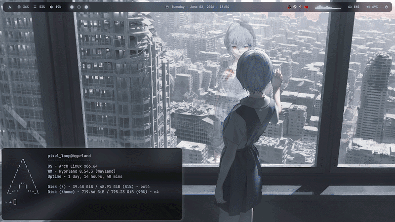

# 🎨 Paletted

A lightweight CLI utility for dynamic theme generation. It derives color palettes from live wallpapers or images and applies them across the system through configurable templates and appliers

## Preview


## How It Works

1. Extract a frame from the wallpaper (or use the image directly)
2. Generate a Material Design color palette with Matugen
3. Apply colors to templates and appliers
4. Execute configured commands and wallpaper backend actions

## Installation

Dependencies: 
- `python >= 3.11`
- `magentum`
- `ffmpeg`
- `pipx`

```sh
pipx install paletted
```

## Configuration

```text
paletted/
├── appliers/
│   └── hyprland.py               # Custom theme applier
├── templates/
│   └── hyprland.lua.template     # Example configuration template
├── config.toml                   # Main configuration file
└── another_config.toml           # Included configuration module
```


### Main Configuration

The main configuration file contains global settings, notification options, wallpaper backends, and imported modules

```toml
# config.toml

# Include external modular configurations
[[include]]
target = "./another_config.toml"

[settings]
# Fallback static image path (extracted frame or symlink) for tools like hyprlock
source_image = "./wallpaper.png"

[notification]
enable = true
summary = "Paletted-Themes"
text = "Theme applied. Wallpaper updated"

# Executed when the wallpaper source is a video
[[backend]]
type = "video"
exec = "smooth-slapper %wallpaper_path%"

# Executed when the wallpaper source is a static image
[[backend]]
type = "image"
exec = "smooth-slapper %wallpaper_path%"

# Target package application mapping
[[package]]
name = "hyprland"
template = "hyprland.conf.template"
target = "~/.config/hypr/theme.conf"
exec = [["hyprctl", "reload"], ["echo", "Goida"]]

# Theme applier name without .py extension
[[appliers]]
applier = "hyprland"
```

### Theme template

Colors can be referenced using placeholders and modifiers:

- `{{color.modifier(factory)}}`

where `color` is the base color, `modifier` is the transformation to apply, and `factory` is the modifier parameter

Modifiers:

```sh
.alpha(factor) -> Sets opacity (0.0 to 1.0)       | Example: {primary.alpha(0.5)}
.dark(factor)  -> Darkens the color (factor > 1)  | Example: {primary.dark(1.2)}
.light(factor) -> Lightens the color (factor > 1) | Example: {secondary.light(1.5)}
.sat(factor)   -> Modulates saturation (0.0 - 5)  | Example: {tertiary.sat(0.5)}
.rgb           -> Formats to CSS rgb/rgba string  | Example: {surface.rgb}
.strip         -> Removes the '#' prefix symbol   | Example: {error.strip}
```

Palette Colors:

```sh
# Primary
accent              = "{primary}"
on_accent           = "{on_primary}"
container           = "{primary_container}"
on_container        = "{on_primary_container}"

# Secondary
accent              = "{secondary}"
on_accent           = "{on_secondary}"
container           = "{secondary_container}"
on_container        = "{on_secondary_container}"

# Tertiary
accent              = "{tertiary}"
on_accent           = "{on_tertiary}"
container           = "{tertiary_container}"
on_container        = "{on_tertiary_container}"

# Surface
background          = "{background}"
on_background       = "{on_background}"
surface             = "{surface}"
on_surface          = "{on_surface}"
variant             = "{surface_variant}"
on_variant          = "{on_surface_variant}"

# Borders
outline             = "{outline}"
outline_variant     = "{outline_variant}"

# Error
accent              = "{error}"
on_accent           = "{on_error}"
container           = "{error_container}"
on_container        = "{on_error_container}"

# Inverse
surface             = "{inverse_surface}"
on_surface          = "{inverse_on_surface}"
primary             = "{inverse_primary}"
```

Example:
```lua
-- hyprland.lua.template

local Colors = {
  active_1 = "{{on_secondary}}",       -- = "#362d3e"
  active_2 = "{{outline}}",            -- = "#968e98"
  inactive = "{{surface}}",            -- = "#151316"
  shadow   = "{{outline.alpha(0.3)}}", -- = "#968e984c"
}

return Colors
```

### Custom appliers

Appliers provide a programmatic way to generate output when template-based substitution is not flexible enough

Each Applier must define a function whose name matches the file name:

```python
# hyprland.py

def hyprland(color_parser) -> None:
  print(color_parser("primary.rgb"))
```

The provided `color_parser` callable can be used to resolve any supported color placeholder


## Usage

Generate and apply a theme:
```sh
palleted apply /path/to/wallpaper  # --source-index 0..3 (usually) --config-dir /path/to/paletted_configs/
```

Restore the previous wallpaper:
```sh
palleted restore  # --config-dir /path/to/paletted_configs/
```

## Why Paletted?

Unlike traditional wallpaper-based theme generators, Paletted supports both static images and video wallpapers. It combines template-based configuration with custom Python appliers, making it possible to handle complex theming workflows that go beyond simple color substitution.

Designed for highly customizable Linux desktops, Paletted can generate themes, update configurations, execute commands, and integrate with existing wallpaper backends in a single workflow.
